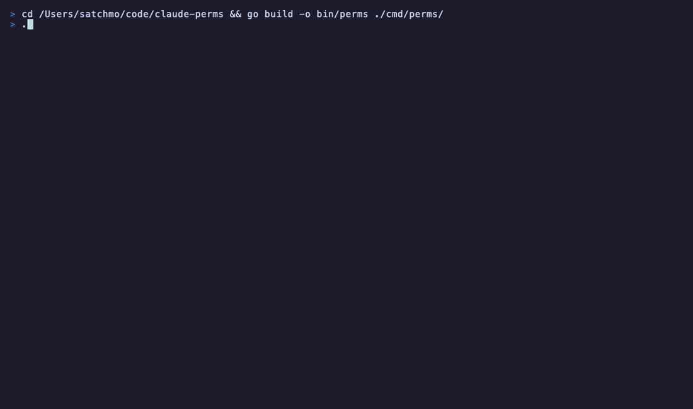

# claude-perms

A TUI tool for analyzing and managing Claude Code permission usage. Parses session logs to show which tools are being called, how often they're approved vs denied, and lets you apply permissions to your settings files with a live diff preview.



## Install

```bash
go install github.com/b-open-io/claude-perms/cmd/perms@latest
```

Or build from source:

```bash
git clone https://github.com/b-open-io/claude-perms.git
cd claude-perms
go build -o bin/perms ./cmd/perms/
```

## Usage

```bash
perms
```

### Views

**Frequency** — All tool permissions ranked by usage, with Allow/Deny counts parsed from session logs. Expand groups to see individual variants (e.g., `Bash(curl:*)`, `Bash(git:*)`). Press Enter on any permission to open the apply modal.

**Matrix** — Agents and their actual tool usage across sessions. Shows which permissions each agent type requests. Select an agent to multi-select permissions and batch-apply them.

**Help** — Keyboard shortcuts reference.

### Applying Permissions

When you apply a permission, the modal shows a live diff preview of the exact settings file that will be edited, with line numbers and colored +/- lines. After applying, a toast notification confirms the file and line that was written.

Permissions are written to:
- **User level**: `~/.claude/settings.local.json`
- **Project level**: `<project>/.claude/settings.local.json`

### Keyboard

| Key | Action |
|-----|--------|
| `j/k` | Navigate |
| `Enter` | Expand group / Open apply modal |
| `Tab` | Switch views |
| `/` | Filter permissions |
| `Esc` | Close modal / Clear filter |
| `q` | Quit |

### Agent Modal (Matrix view)

| Key | Action |
|-----|--------|
| `Space` | Toggle permission selection |
| `A` | Apply selected permissions |
| `j/k` | Navigate |
| `Esc` | Close |

## How It Works

Parses JSONL session logs from `~/.claude/projects/` to extract `tool_use` events and correlate them with `tool_result` responses. User denials are detected by checking for `is_error: true` with content containing "rejected" — command failures (exit codes, etc.) are not counted as denials.

Results are cached in `~/.claude/perms-cache.json` for fast subsequent launches.

## License

MIT
